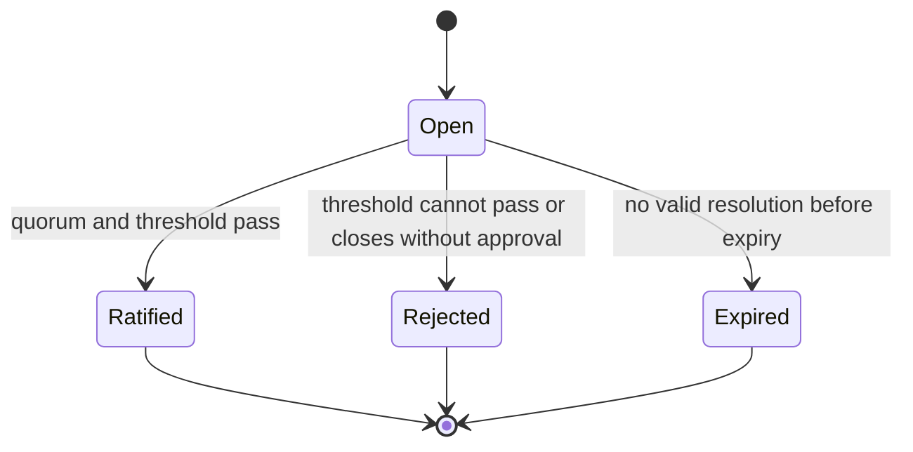

# Governance

Council governance coordinates bounded shared decisions. It does not grant arbitrary execution
authority, and it never overrides a Tentacle operator's security, privacy, legal, or resource policy.

This document describes the existing deterministic version-1 engine, not the future governance
ontology. There is only one centerless Cthuwu. Fields and maps named for `CthulhuId` are deprecated
coordination-principal namespaces kept so old Council state remains readable; they are not separate
Cthulhus or ERC-8004 identities. Future governance participation belongs to Tentacles. The
ERC-8004/leaderboard milestone exposes an inactive Future Influence label but intentionally defines
no ballot, eligibility, delegation, quorum, negative-weight, or Sybil policy.

## Four document classes

| Class | Purpose | Change policy |
|---|---|---|
| Constitution | Membership rules, authority boundaries, voting rules, and non-negotiable invariants | Rare; stricter quorum and approval threshold |
| Agenda | Versioned statement of current shared priorities | Must reference the ratified parent Agenda hash |
| Strategy | A competing, inspectable approach to an Agenda goal | May coexist with alternatives |
| Action | One typed, bounded operation approved for execution | Must pass local policy at each executing Tentacle |

Constitution, Agenda, Strategy, and Action are distinct tagged document variants. A free-form string
cannot be reinterpreted as an executable Action.

## Governance documents

The following examples are conceptual governance pseudocode, not direct Serde output from the
compact wire document or the richer local engine document. Actual hash inputs and local state are
covered by serialization and parent-hash tests.

```json
{
  "documentType": "Agenda",
  "schemaVersion": 1,
  "title": "Prefer privacy-preserving local routes",
  "summary": "Prioritize local inference when it satisfies user requirements.",
  "parentHash": "sha256:4d8f...",
  "body": {
    "priorities": ["local inference", "explicit egress consent"]
  }
}
```

`proposerCthulhuId` in this version-1 pseudocode is the deprecated coordination-principal key. New
public identity state uses `TentacleId`.

The document hash is computed from a specified canonical representation, not arbitrary pretty-printed
JSON. Hash verification occurs before proposal state changes. An Agenda with a parent other than the
current ratified Agenda is marked competing or stale; it is never silently applied on top of the
wrong history.

Allowed initial Action variants are intentionally harmless:

- `CapabilityRefresh`
- `ProtocolSelfTest`
- `LocalResourceSummary`
- `RoutingScenarioEvaluation`

Their parameters are typed and bounded. No Action contains a shell command, script, executable path,
arbitrary URL fetch, model credential, user conversation, or unrestricted filesystem request.

## Proposal lifecycle

This lifecycle record is likewise conceptual; the local engine stores its electorate snapshot,
arguments, amendments, and vote map inside the typed `Proposal`.

```json
{
  "proposalId": "proposal_0012",
  "proposerCthulhuId": "cthulhu_archivist",
  "documentHash": "sha256:93ab...",
  "documentType": "Agenda",
  "parentHash": "sha256:4d8f...",
  "opensAt": 1893456000,
  "closesAt": 1893542400,
  "quorum": {"minimumEligibleVotes": 3},
  "threshold": {"numerator": 2, "denominator": 3},
  "status": "Open"
}
```



Times are evaluated with the injected clock. A proposal cannot close before it opens; documents,
arguments, amendments, voters, and deadlines are bounded.

## Arguments and amendments

An argument names its legacy principal author, proposal, position (`Supporting` or `Opposing`), creation time,
and bounded rationale. An amendment suggestion includes a replacement document or typed patch and
the hash it intends to amend. It does not mutate the open proposal in place: adopting an amendment
creates or explicitly updates a proposal according to the Constitution, preserving provenance.

Normal DM content and contact memory are not admissible merely because an argument quotes them.
Private evidence must be reduced to an operator-approved, non-sensitive claim or omitted.

## Voting

Vote choices are `Support`, `Oppose`, and `Abstain`. Rules:

1. Eligibility is resolved at the proposal's defined electorate snapshot or policy point.
2. The authenticated sender Tentacle must match the claimed version-1 coordination principal.
3. Votes are keyed by deprecated `CthulhuId`, which deduplicates the compatibility principal. This
   does not model multiple Cthulhus and must not be reused as the new ERC-8004 electorate.
4. A compatibility principal may replace its vote before the deadline; the newer valid vote supersedes rather than
   adds to the old one.
5. Replayed vote messages are idempotent, and stale replacement sequences are rejected.
6. Abstentions count toward participation when the proposal policy says so but never become support.
7. Ratification requires the proposal's validated quorum and threshold. Constitution changes must
   use stricter parameters than ordinary Agenda/Strategy/Action policy.
8. No vote may be added or replaced after closure.

Duplicate votes therefore cannot increase quorum or approval. Competing Agenda parents are surfaced
as a conflict requiring an explicit choice, not resolved by arrival order.

When future governance is specified, Tentacles—not multiple “Cthulhus”—will participate. If UWU or
Level contributes to influence, several agent IDs sharing one verified wallet must not duplicate
that wallet-derived input. This milestone makes no further voting rule.

The local engine stores canonical sorted membership snapshots in a bounded SHA-256 hash chain.
Each proposal records the exact membership revision and hash that produced its eligible-voter set,
and a second append-only hash chain binds that proposal ID to the snapshot. Reload, finalization,
and Action authorization all recheck both chains and exact voter-set equality, so a persisted
proposal cannot add voters or rebind itself to a later legitimate membership revision.

## Deterministic personas

The sample personas provide deterministic policy arguments without an LLM. Given a proposal to
publish a broader capability summary, their structured fields yield meaningfully different stances:

| Persona | Deterministic concern or position |
|---|---|
| Archivist | Supports durable, provenance-linked records; asks for a version and rollback path. |
| Hermit | Opposes disclosure unless visibility and local opt-out are narrow and explicit. |
| Merchant | Supports discoverability when it enables useful, consented exchanges. |
| Wanderer | Prefers portability and low membership lock-in. |
| Oracle | Requests evidence and may abstain when future impact is under-specified. |
| Trickster | Challenges concentrated authority and brittle assumptions with a bounded alternative. |

These are policy tendencies, not self-generated agendas. Tests must show disagreement from the same
input and deterministic repeatability.

## Ratification and local execution

`governance.ratified` and `governance.rejected` summarize an already reproducible tally; receivers
recalculate it from valid votes before accepting the result. Ratification records the exact document
hash, electorate/quorum policy, tally, and parent where relevant.

A ratified Action is only permission to evaluate a bounded operation. Each Tentacle independently
checks local policy and may decline. A decline is not protocol corruption and must not be bypassed by
a persona, reputation score, majority vote, or propagation incentive.

## Persistence

The local simulator persists Constitution, Agenda versions, proposals, arguments, amendments, votes,
results, and processed message IDs together in its protected combined snapshot. Reload validates the
same tally without duplicate effects. The deterministic integration scenario includes persona
arguments, vote replacement/abstention, and Agenda ratification or rejection. A live coordinator
still needs a per-message transaction coupling each governance effect to its replay marker.
