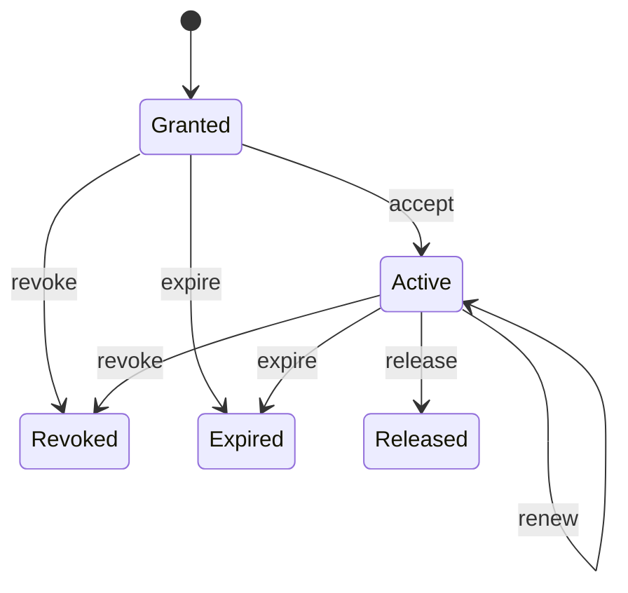

# Leases and failover

A lease authorizes exactly one Tentacle incarnation to handle one session for a bounded time. Leases
prevent two runtimes from both believing they own new work after restart or failover.

The version-1 `assignedCthulhuId` and `issuerCthulhuId` fields below are deprecated coordination
principal namespaces retained for compatibility. They do not denote multiple Cthulhus or ERC-8004
owners; the authoritative runtime target remains the stable Tentacle plus incarnation/generation.

## Lease record

The following is a conceptual state sketch combining the wire and local engine vocabulary; it is not
copy-paste Serde output. The validated wire type names its user field `userReference` and the local
engine names it `user`, while both carry the same privacy and fencing semantics.

```json
{
  "leaseId": "lease_0042_0003",
  "sessionId": "session_0042",
  "userRef": {"kind": "salted-local-reference", "value": "userref_8d91"},
  "assignedCthulhuId": "cthulhu_archivist",
  "assignedTentacleId": "tentacle_archivist_home",
  "tentacleIncarnation": {
    "id": "incarnation_0002",
    "generation": 2
  },
  "generation": 3,
  "issuedAt": 1893456000,
  "expiresAt": 1893456300,
  "renewalDeadline": 1893456240,
  "routingRequestId": "request_0007",
  "issuerCthulhuId": "cthulhu_router",
  "status": "Active"
}
```

The user reference follows the privacy policy in [Routing](routing.md); it does not contain message
content or contact memory.

## State and operations

| Operation | Preconditions | Result |
|---|---|---|
| grant | Valid award, current target incarnation, next session generation | `Granted` lease |
| accept | Same target and generation; before expiry | `Active` lease |
| renew | Active, before renewal deadline, current incarnation | Later bounded expiry; same generation |
| release | Active/granted holder voluntarily finishes | Terminal `Released` |
| revoke | Authorized issuer/policy decision | Terminal `Revoked` |
| expire | Injected clock reaches expiry or a required renewal deadline is missed | Terminal `Expired` |
| failover | Old lease terminal/unavailable and new route succeeds | New lease with strictly greater generation |

`accept` is a domain operation, not an invented extra Council message type in version 1. Adapters map
the grant/award acknowledgement onto their authenticated delivery semantics. The local simulator
calls the domain transition explicitly.



Terminal states cannot be renewed or accepted.

The wire and local status sets are aligned as `Granted`, `Active`, `Released`, `Revoked`, and
`Expired`. Failover is an operation: it revokes the old lease and grants a new, higher generation;
it is not a separately persisted lease status.

## Generation fencing

The authoritative fencing tuple is:

```text
(sessionId, leaseGeneration, assignedTentacleId, incarnationId, incarnationGeneration)
```

For a session, every failover grant has a generation greater than all earlier persisted grants. A
Tentacle accepts new work only when the request carries its current incarnation and the greatest
accepted lease generation. Old generations remain rejected even if their original lease has not yet
expired according to a partitioned runtime's clock.

Grant and generation persistence are one atomic logical effect. A crash must not expose a grant
without recording the generation fence, or advance the fence without recording the grant outcome.

## Failover

1. The injected clock/liveness evaluator marks the current Tentacle unavailable, or an authenticated
   withdrawal/revocation arrives.
2. The existing lease is revoked or expired locally. No new work is sent to its generation.
3. Routing runs again with current hard requirements; the previous affinity is only a preference if
   still valid.
4. The issuer grants a strictly newer generation to a current incarnation.
5. The new Tentacle accepts, then rendezvous returns its direct XMTP endpoint.

Failover does **not** silently copy contact notes, DM transcripts, embeddings, or private model
memory. Memory transfer requires a separate future user-authorized protocol. The new Tentacle may
start without that memory and must say so honestly.

## Council messages

- `lease.grant` carries the new authorization.
- `lease.renew` extends an active lease within policy.
- `lease.release` records voluntary completion.
- `lease.revoke` fences the lease before normal expiry.
- `lease.expired` records deterministic expiry observation.

Each message is subject to envelope replay, expiry, sender authorization, incarnation, and generation
validation. A duplicate release or expiry is idempotent; it never earns duplicate contribution
credit or triggers a second failover.

## Persistence and restart

The local simulator persists current and terminal leases, the greatest session generation, affinity,
and processed message IDs together in its protected combined snapshot. Reload validates that state
without duplicate effects. The local integration test covers grant, failure, failover, reload, and
rejection of the old incarnation/generation. A live coordinator still needs a per-message transaction
that commits each lease effect with its replay marker.
