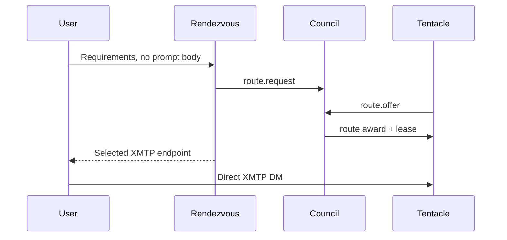

# Routing and rendezvous

The routing engine is independent of XMTP and inference. It consumes validated local state and
returns a deterministic decision plus an explanation. It never receives a normal DM body.

## Route request

A request may contain capability and privacy requirements, preferences, and an opaque or
privacy-preserving user reference. The following is conceptual protocol pseudocode that highlights
policy; it is not direct Serde output from either the wire `RouteRequest` or local `RoutingRequest`.

```json
{
  "requestId": "request_0007",
  "sessionId": "session_0042",
  "userRef": {"kind": "salted-local-reference", "value": "userref_8d91"},
  "required": {
    "protocolVersions": ["1.0"],
    "capabilities": ["chat"],
    "tools": ["local-search"],
    "localInference": true,
    "privacyProperties": ["no-provider-egress"],
    "maximumLoadFraction": 0.8
  },
  "preferredCthulhuId": null,
  "preferredTentacleId": null,
  "useExistingAffinity": true,
  "trustPolicy": {"allowlistedOnly": true},
  "expiresAt": 1893456060
}
```

The user reference is used only where necessary for affinity/lease policy and must not be a raw
conversation or contact note. A deployment may use an authenticated XMTP inbox reference when the
privacy policy permits it, or a stable scoped reference when it does not.

## Selection algorithm

The engine first rejects expired requests and filters candidates that fail any hard requirement:
current incarnation, eligible lifecycle and health, protocol compatibility, capabilities, privacy,
local-inference requirement, tools, trust policy, capacity, maximum load, and local blocks.

It then evaluates the remaining candidates in this general order:

1. explicit user choice;
2. valid existing session affinity;
3. healthy home Tentacle;
4. hard privacy and capability requirements (already enforced as filters);
5. user-owned Tentacle;
6. available capacity;
7. protocol compatibility;
8. trusted registry or allowlist status;
9. selected provenance-bearing reputation signals;
10. current load;
11. stable deterministic tie-breaker.

Explicit choice, affinity, and home status never bypass hard requirements. Reputation is considered
only when the request's trust policy recognizes its source. The tie-breaker uses stable identifiers,
not arrival order or randomness, so identical state produces the same result.

## Structured explanation

This second conceptual sketch abbreviates the implemented `RoutingDecision.explanation` candidate
records; tests assert the actual local serialization and ordering behavior.

```json
{
  "requestId": "request_0007",
  "selected": "tentacle_archivist_home",
  "hardFilters": [
    {"candidate": "tentacle_merchant_remote", "rejected": "local inference required"}
  ],
  "ranking": [
    {
      "candidate": "tentacle_archivist_home",
      "reasons": ["valid affinity", "healthy", "allowlisted", "2 of 4 slots free"]
    }
  ],
  "tieBreaker": "tentacle-id ascending",
  "privateContentUsed": false
}
```

Explanations expose only routing facts already visible to the requester under policy. They do not
copy private manifests or registry evidence indiscriminately.

## Offers and awards

A `route.request` is bounded and expires quickly. Eligible Tentacles may return `route.offer` with
their current incarnation, capacity claim, expiry, and any policy constraints, or `route.reject` with
a safe reason code. Version 1 has no independent manifest-revision field. The router ignores late
offers and awards one current offer through `route.award`, followed by a generation-fenced lease.
Awarding does not itself transmit the user's DM history.

## Affinity

Affinity is a preference for continuity, not permanent authority. It is valid only while the target
is the expected Cthulhu/Tentacle incarnation, passes current hard requirements and policy, and is
healthy enough for the requested operation. An invalid affinity is explained and ignored. Failover
may establish a new affinity only after the new lease is accepted.

## Rendezvous service

`RendezvousService` abstracts the discovery handoff. The local implementation models:



The final line is the existing direct-message data plane. The Council observes neither its ordinary
content nor the selected Tentacle's private memory.

**Implemented — local:** deterministic routing and rendezvous over local state/in-memory transport.
**Planned:** live Council routing through an XMTP group.
