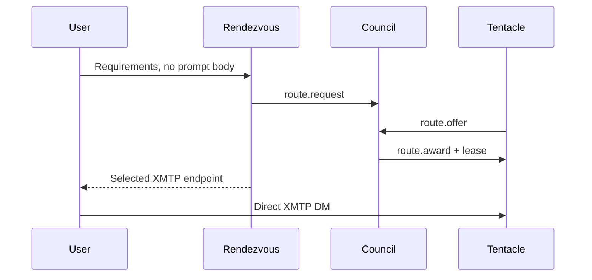

# Routing and rendezvous

The routing engine is independent of XMTP and inference. It consumes validated local state and
returns a deterministic decision plus an explanation. It never receives a normal DM body.

Version-1 `preferredCthulhuId`, “home,” and ownership fields below refer to a deprecated
coordination-principal namespace associated with a Tentacle. There is only one centerless Cthuwu;
these compatibility fields never identify individual Cthulhus or ERC-8004 owners.

## Browser assignment is a separate boundary

The Direct/Acolytes/Global browser workspace does **not** use this Council scoring engine to choose
its assigned Tentacle. It derives the acolyte address only from the recovered browser
`StoredIdentity` and applies the deterministic Acolyte Branding rule.

Production defaults to the pinned canonical Branding deployment and rejects alternate overrides.
The decision binds one explicit Base block.
At that block the browser must revalidate the Branding and exact controller, current
owner/controller wallet, canonical Identity Registry deployment and version, byte-exact allegiance
and protocol, and the same agent's on-chain ERC-8004 registration resolving to the selected
production XMTP endpoint. Agent0 and the leaderboard cache may aid discovery or display, but they
are never routing authority.

`NotConfigured`, `Expired`, and positively verified `Ineligible` select the configured intro
Tentacle. A first `Unminted` connection without an explicit or retained verified route races the
bounded typed liveness exchange described in the channel protocol; only its first authenticated,
in-window, freshly Base-verified responder may become Direct, and no response remains explicit.
For a configured deployment, `RegistryUnavailable`, inconsistent same-block reads, or an
unverifiable canonical endpoint freezes assignment and exposes retry. No Council route award,
cached record, claimed control payload, group name, or non-response may turn that outage into
fallback or ineligibility.

An explicit verified `#t=` choice skips the liveness exchange. For a fresh Unminted Acolyte it is a
Direct-only route and sends no group-enrollment control; the browser marks Acolytes and Global as
policy-blocked rather than presenting an assignment wait that cannot complete.

The assignment is revalidated on connect, PWA resume, and a bounded interval. Reassignment replaces
the exact Direct and Acolytes conversation bindings while retaining the Global logical binding.
Global is represented by `readConversationIds[]` and one `writeConversationId`; its singleton
production group must be explicitly bootstrapped before any future sharding. These exact
conversation bindings and assignment revisions remain off-chain.

Versioned `cthuwu.join.v1` and `cthuwu.assignment.v1` messages perform enrollment after assignment.
The XMTP envelope authenticates the sender; payload-claimed addresses and IDs do not. The Agent SDK
sidecar intercepts control content before Rust, inference, contact memory, or ordinary history, and
normal group chatter has no personal-DM inference route in version 1. See
[Acolyte XMTP channels](../acolyte-channels.md) for group validation, 14-day retention, and release
gates.

## Route request

A request may contain capability and privacy requirements, preferences, and an opaque or
privacy-preserving user reference. The following is conceptual protocol pseudocode that highlights
policy; it is not direct Serde output from either the wire `RouteRequest` or local `RoutingRequest`.

```json
{
  "requestId": "request_0007",
  "sessionId": "session_0042",
  "userRef": {"kind": "salted-local-reference", "value": "userref_8d91"},
  "required": {
    "protocolVersions": ["1.0"],
    "capabilities": ["chat"],
    "tools": ["local-search"],
    "localInference": true,
    "privacyProperties": ["no-provider-egress"],
    "maximumLoadFraction": 0.8
  },
  "preferredCthulhuId": null,
  "preferredTentacleId": null,
  "useExistingAffinity": true,
  "trustPolicy": {"allowlistedOnly": true},
  "expiresAt": 1893456060
}
```

The user reference is used only where necessary for affinity/lease policy and must not be a raw
conversation or contact note. A deployment may use an authenticated XMTP inbox reference when the
privacy policy permits it, or a stable scoped reference when it does not.

## Selection algorithm

The engine first rejects expired requests and filters candidates that fail any hard requirement:
current incarnation, eligible lifecycle and health, protocol compatibility, capabilities, privacy,
local-inference requirement, tools, trust policy, capacity, maximum load, and local blocks.

It then evaluates the remaining candidates in this general order:

1. explicit user choice;
2. valid existing session affinity;
3. healthy Tentacle associated with the legacy home principal;
4. hard privacy and capability requirements (already enforced as filters);
5. Tentacle associated with the requesting legacy principal;
6. available capacity;
7. protocol compatibility;
8. trusted registry or allowlist status;
9. selected provenance-bearing reputation signals;
10. current load;
11. stable deterministic tie-breaker.

Explicit choice, affinity, and home status never bypass hard requirements. Reputation is considered
only when the request's trust policy recognizes its source. The tie-breaker uses stable identifiers,
not arrival order or randomness, so identical state produces the same result.

## Structured explanation

This second conceptual sketch abbreviates the implemented `RoutingDecision.explanation` candidate
records; tests assert the actual local serialization and ordering behavior.

```json
{
  "requestId": "request_0007",
  "selected": "tentacle_archivist_home",
  "hardFilters": [
    {"candidate": "tentacle_merchant_remote", "rejected": "local inference required"}
  ],
  "ranking": [
    {
      "candidate": "tentacle_archivist_home",
      "reasons": ["valid affinity", "healthy", "allowlisted", "2 of 4 slots free"]
    }
  ],
  "tieBreaker": "tentacle-id ascending",
  "privateContentUsed": false
}
```

Explanations expose only routing facts already visible to the requester under policy. They do not
copy private manifests or registry evidence indiscriminately.

## Offers and awards

A `route.request` is bounded and expires quickly. Eligible Tentacles may return `route.offer` with
their current incarnation, capacity claim, expiry, and any policy constraints, or `route.reject` with
a safe reason code. Version 1 has no independent manifest-revision field. The router ignores late
offers and awards one current offer through `route.award`, followed by a generation-fenced lease.
Awarding does not itself transmit the user's DM history.

## Affinity

Affinity is a preference for continuity, not permanent authority. It is valid only while the target
is the expected legacy-principal/Tentacle incarnation, passes current hard requirements and policy, and is
healthy enough for the requested operation. An invalid affinity is explained and ignored. Failover
may establish a new affinity only after the new lease is accepted.

## Rendezvous service

`RendezvousService` abstracts the discovery handoff. The local implementation models:



The final line is the existing direct-message data plane. The Council observes neither its ordinary
content nor the selected Tentacle's private memory.

**Implemented — local:** deterministic routing and rendezvous over local state/in-memory transport.
**Planned:** live Council routing through an XMTP group.

The separate acolyte channel implementation has a funded verified Branding deployment and local
typed assignment/mint/liveness paths, but no configured production Global group or passing funded
production browser/XMTP end-to-end gate. It must not be cited as evidence of live Council or
production group interoperability.
